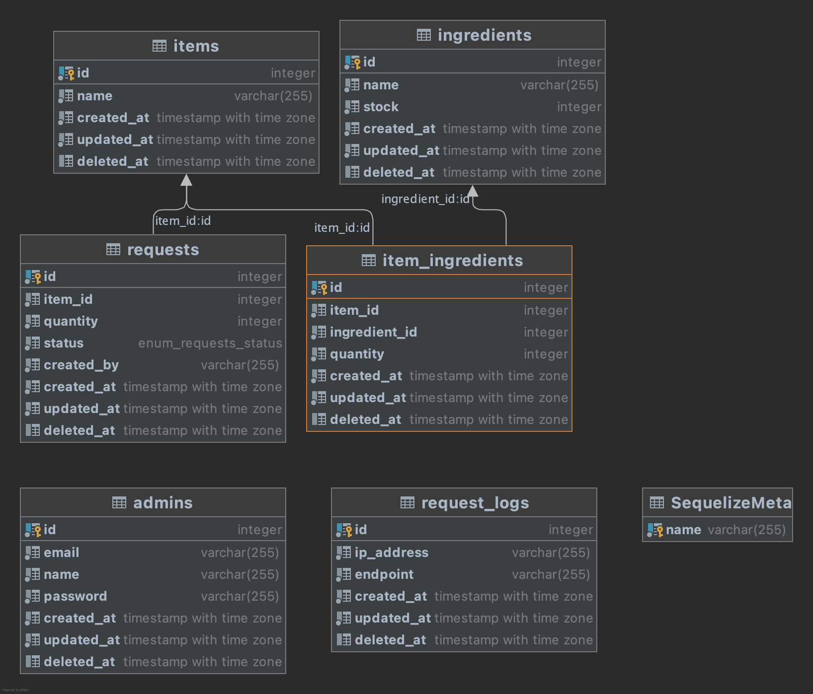

# Tugas Besar 2 - Web Services Using SOAP and REST
Dorayaki Factory Server 
IF3110 - Pengembangan Perangkat Lunak Berbasis Web

## Table of Contents
- [Tugas Besar 2 - Web Services Using SOAP and REST](#tugas-besar-2---web-services-using-soap-and-rest)
  - [Table of Contents](#table-of-contents)
  - [Author](#author)
  - [Penjelasan Singkat](#penjelasan-singkat)
  - [Skema Basis Data](#skema-basis-data)
  - [Requirements](#requirements)
  - [Cara Instalasi](#cara-instalasi)
  - [Dokumentasi API](#dokumentasi-api)
  - [Pembagian Tugas](#pembagian-tugas)

## Author
- Shifa Salsabiila (13519106)
- Ryo Richardo (13519193)
- Andres Jerriel Sinabutar (13519218)

## Penjelasan Singkat
Dorayaki Factory Server adalah bagian dari sistem DoraStore yang berperan sebagai backend service untuk pabrik dorayaki. Service ini berfungsi untuk menghubungkan Frontend dan Interface pabrik dengan database. Service ini dibangun dengan protokol REST API dalam NodeJS dengan menggunakan kakas ExpressJS. Database dibangun dengan menggunakan PostgreSQL yang di-*deploy* di cloud. 

## Skema Basis Data

## Requirements
1. [NodeJS 16](https://nodejs.org/en/)
2. [npm](https://www.npmjs.com/) 
3. [Docker](https://www.docker.com/)

## Cara Instalasi
1. Clone repository ini dengan menggunakan `git clone` via HTTP atau SSH.
2. Lengkapi requirements yang disebutkan pada bagian sebelumnya.
3. Buka Terminal (jika menggunakan Linux atau MacOS) atau Command Prompt (jika menggunakan Windows). Lalu, navigasi menuju direktori folder dimana Anda mengunduh atau meng-*clone* repositori ini.
4. Nyalakan docker dengan perintah `docker start` atau dengan membuka  dashboard aplikasi Docker Desktop.
5. Untuk penggunaan pertama kali, jalankan perintah `docker-compose up --build` untuk menjalankan aplikasi. Jika Anda sudah pernah menjalankan perintah `--build` sebelumnya, Anda bisa menjalankannya kembali dengan perintah `docker-compose up`.
6. Server akan berjalan di port 3000.

## Dokumentasi API
Dokumentasi API dapat diakses melalui pranala [ini](https://documenter.getpostman.com/view/13639528/UVCBA4Za).

## Pembagian Tugas
**REST**
| Fitur  | 13519106 | 13519193 | 13519218 |
| --- | --- | --- | --- |
| Database Pabrik |  |  | :white_check_mark: |
| Autentikasi Pengguna   |  |  |  :white_check_mark:|
| Pengelolaan Request Penambahan Stok   |  |  | :white_check_mark: |
| Manajemen Resep   |  |  | :white_check_mark: |
| Manajemen Bahan Baku  |  |  | :white_check_mark: |
| Notifikasi Email  |  |  | :white_check_mark: |
